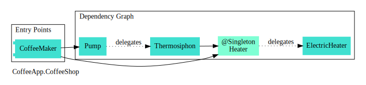

# Scabbard

<b>A tool to visualize and understand your Dagger 2 dependency graph.</b>

 

 

More advanced [examples](https://arunkumar9t2.github.io/scabbard/examples/).

## Features

* **Visualize** entry points, dependency graph, component relationships and scopes in your [Dagger 2](https://github.com/google/dagger) setup.

* **Minimal setup** - Scabbard's Gradle plugin prepares your project for graph generation and provides ability to customize graph generation behavior.

* **IDE integration** - Easily view a `@Component` or a `@Subcomponent` graph directly from source code via gutter icons (IntelliJ/Android Studio).

* **Supports** both Kotlin and Java.

## Getting Started

For samples, guide and usage instructions please visit the [project website](https://arunkumar9t2.github.io/scabbard/).

## License

    Copyright 2020 Arunkumar

    Licensed under the Apache License, Version 2.0 (the "License");
    you may not use this file except in compliance with the License.
    You may obtain a copy of the License at

        http://www.apache.org/licenses/LICENSE-2.0

    Unless required by applicable law or agreed to in writing, software
    distributed under the License is distributed on an "AS IS" BASIS,
    WITHOUT WARRANTIES OR CONDITIONS OF ANY KIND, either express or implied.
    See the License for the specific language governing permissions and
    limitations under the License.
