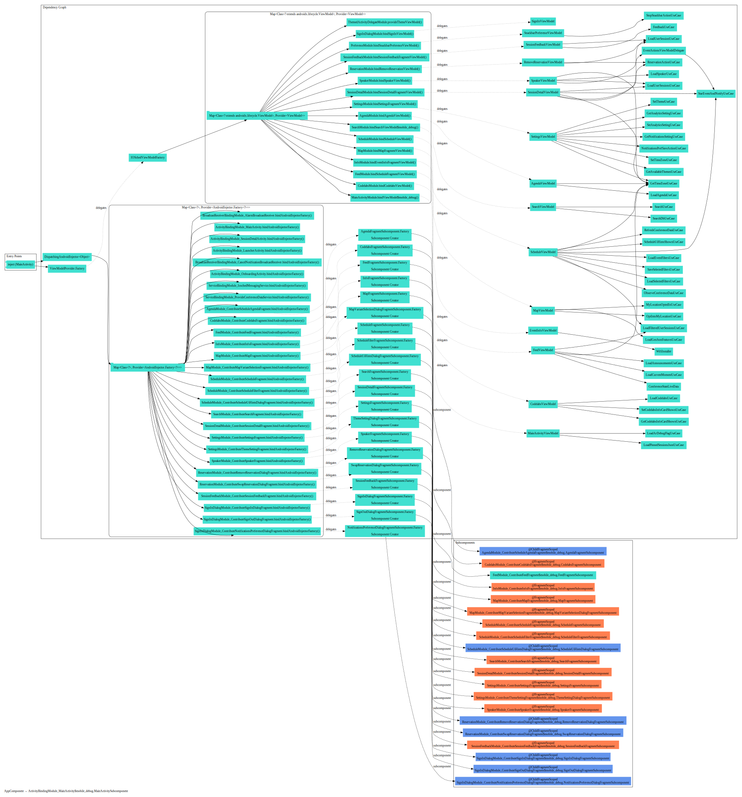

# Examples

Please download/open in new tab to zoom contents.

## [Coffee App from Dagger](https://github.com/google/dagger/tree/master/examples/simple/src/main/java/coffee)

## [Google I/O 2019 App](https://github.com/google/iosched)

<video width="100%" controls>
  <source src="../video/iosched_appcomponent.mp4" type="video/mp4">
  Your browser does not support the video tag.
</video>

### `AppComponent`

### `MainActivitySubComponent`

## [Santa Tracker](https://github.com/google/santa-tracker-android)

### `AppComponent`

## [Plaid](https://github.com/android/plaid)

### `HomeComponent`

### `UpvoteStoryServiceComponent`
