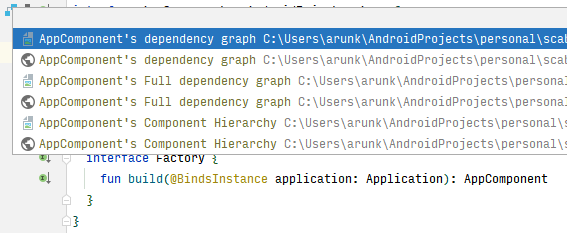
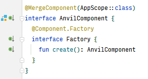

# Features

## Gutter Icons

Gutter icons to view generated images for `@Component` and `@Subcomponent`

## Visualize Component Hierarchy

For every `@Component`, Scabbard generates a component heirarchy image with unique color for each scope.

## Interactive SVG graphs

When SVG graphs generated by Scabbard are opened in the browser, it is possible to navigate between `@Component` and `@Subcomponent` by simple clicking on the node as show below.
 
<video width="100%" controls>
  <source src="../video/svg_sample.mp4" type="video/mp4">
  Your browser does not support the video tag.
</video>

You can use gutter icon to directly open the image in browser.

## Missing binding visualization

Scabbard adds hypelink to component name in console log whenever Dagger's missing binding error is detected. This hypelink can be used to open full binding graph image which contains missing binding information.

This requires [full binding graph](configuration.md#enable-full-binding-graph-validation) validation to be enabled.

<video width="100%" controls>
  <source src="../video/missing-binding-visualization.mp4" type="video/mp4">
  Your browser does not support the video tag.
</video>

## Hilt and Anvil Support

Scabbard adds gutter icons to both Hilt and Anvil's component abstractions.

### Anvil

### Hilt

